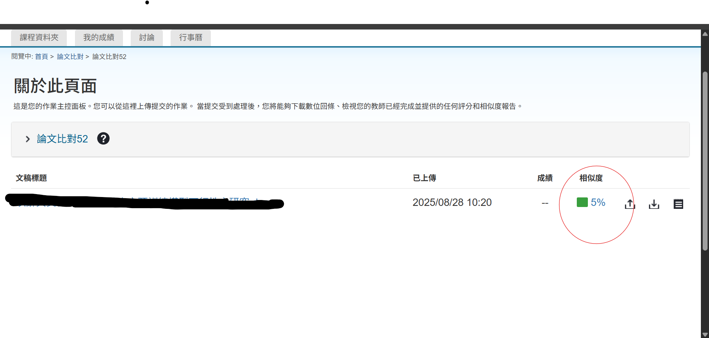
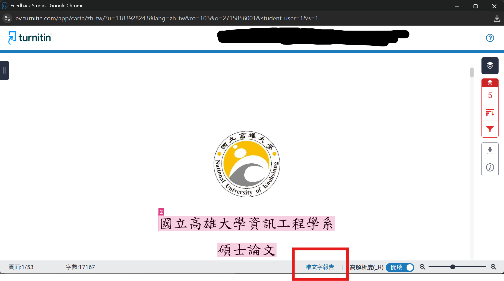
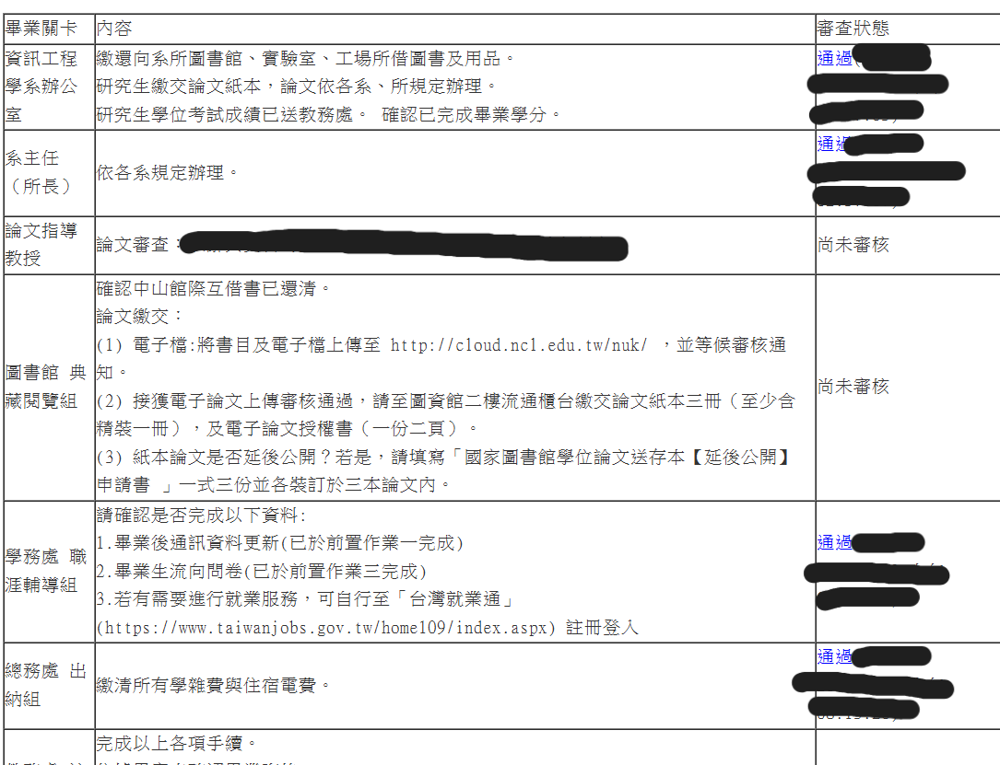
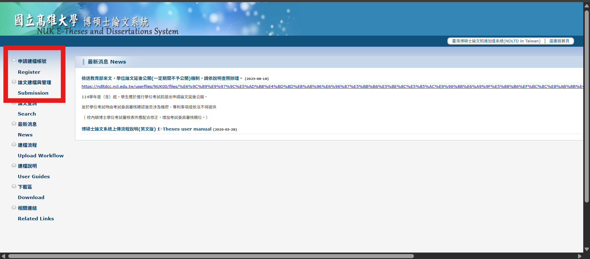

# NUKCSIE
由於學校沒有一套從口試到畢業的完整流程文件，所以我創建了一份Github Repo希望能幫助到未來的學弟妹
## 口試前
1. 口試申請需要準備以下文件(論文計劃書及學位考試委員名冊皆放在[口試申請資料](口試申請資料/README.md)內也可以去[系網](https://www.csie.nuk.edu.tw/links/13)下載):
	1. 碩士論文計畫書(建議口試前一個學期初繳交至系辦)
	2. 學位考試委員名冊:詢問指導教授何時口試以及教授約的口試委員姓名。
	3. 學位考試申請表(需要去教務系統->學位考試申請作業填寫然後列印下來，英文姓名記得全部都要大寫)，以上文件建議列印3~4份備用。
2. 開通Turnitin帳號:
	1. 建議使用學校的gmail(學號@mail.nuk.edu.tw)寄信給圖書館(myfu0626@nuk.edu.tw)請他們幫你開通。開通後上傳你的論文電子檔進行比對。
	2. 比對完成後點相似度。
	3. 點唯文字報告然後下載。
3. 學術倫理:[去教育部學術倫理資源中心](https://ethics.moe.edu.tw/)->登入->個人註冊接著開始閱讀課程內容，想省時間可以點進去然後馬上換下一篇看。全部看完後會有個測驗，可以開新視窗用google查答案。通過後會有個證書建議列印3~4份備用。
4. 總共需要繳交碩士論文計畫書、學位考試委員名冊、學位考試申請表、論文比對報告、學術倫理證書到系辦，這些文件需要在口試前一個月內處理好，以上文件建議列印3~4份備用。
5. 申請通過後系辦會製作聘書，建議與紙本論文一同寄給口試委員。
6. 所需資料繳交後，需要在口試一周前列印口試委員數量x2份紙本論文，一份寄給口試委員一份口試當天給口試委員看。
7. 建議口試前一周做好口試PPT。
---
## 口試中
1. 口試前一至兩天列印:
	1. 一份論文審定書
	2. 口試委員數量的學位考試評分表
	3. 學位考試成績通知單
	4. 口試委員數量的紙本PPT
2. 準備咖啡或茶以及小點心(蛋糕或餅乾)，建議詢問指導教授。
3. 打掃口試當天使用的會議室(或實驗室)，並測試硬體設備能夠正常使用。
4. 口試當天提早一小時抵達準備口試，並且去系辦拿領據給口試委員簽名。
5. 若是聘書來不及與論文一同繳交最遲口試當天要給口試委員。
---
## 口試後
若是論文沒有需要特別修改的地方建議馬上跑畢業流程，若有需要修改的部分建議在新學期開學前3周開始跑畢業流程。
1. 先去[畢業生離校作業網站](https://webap.nuk.edu.tw/leave/)填寫資料後會跳到這個介面審查約1~2天就會審查完，論文指導教授欄位需要請指導教授登入系統幫你通過。
2. 教授確認論文沒有問題後，論文電子檔需要加上[浮水印](論文列印/國立高雄大學浮水印.jpg)，需要到[台灣碩博士論文網站](https://ndltd.ncl.edu.tw/cgi-bin/gs32/gsweb.cgi/login?odwebmge)註冊登入，接著到[高雄大學碩博士論文系統](https://cloud.ncl.edu.tw/nuk/)申請建檔帳號(需要與台灣碩博士論文的帳號密碼相同)。
3. 接著按論文建檔與管理，登入後就可以開始填基本資料與上傳論文電子檔給圖書館審查(約1~2個工作天)。
4. 上傳電子檔前需要列印授權書給教授簽名，建議提前跟教授約時間。授權書分為兩種一種是給學校圖書館一種是給國家圖書館，建議都印5份左右。 
5. 論文電子檔審核通過後可以去工學院對面的[複製館](https://maps.app.goo.gl/eTXZWDACjEyYD7Bs8)，這間常做我們學校的論文會較清楚，也可以給其他間影印店做，建議先電話詢問製作時長及費用，通常需要3~5個工作天。列印1本精裝跟4本平裝(3本要交給學校，你自己可以留1本)，相關裝訂事項可以到[這裡](https://cloud.ncl.edu.tw/nuk/upload.php)的紙本論文裝訂事項查看。需要注意的是每本精裝跟平裝皆需要1張論文授權書(給學校圖書館的)正本，1張論文審定書影本。
6. 等待論文裝訂的時間可以先去學校教務處(校門口進去靠左直走約3min可以看到左手邊有一間建築進去後就可以看到了)領畢業資格審核表拿去系辦審核後繳回。
7. 論文裝訂好後準備2張論文授權書(1張給國家圖書館1張給學校圖書館)，隨1本精裝3本平裝論文繳交至學校圖書館(校門口進去靠右直走約3min可以看到右手邊有一間建築進去後就可以看到了)。
8. 確認上圖中除了最後一項的畢業離校關卡皆通過後就可以去教務處申請列印畢業證書了，需要注意學校各處室的休息時間為12:00~13:30並且寒暑假期間周五沒有上班。
9. 以上資訊皆以學校公告為準，本文件撰寫十間為2025年9月，未來可能不會隨學校政策同步更新，有任何問題可以打去系辦(07-591-9518)詢問相關細節，相關文件可以在本Repo內的資料夾內找到。
---
## 參考資料
1. [資工系網口試申請懶人包](https://wry-path-41f.notion.site/717e45b893014cee817e3328410c9cee)
2. [高雄大學碩博士論文系統](https://cloud.ncl.edu.tw/nuk/upload.php)